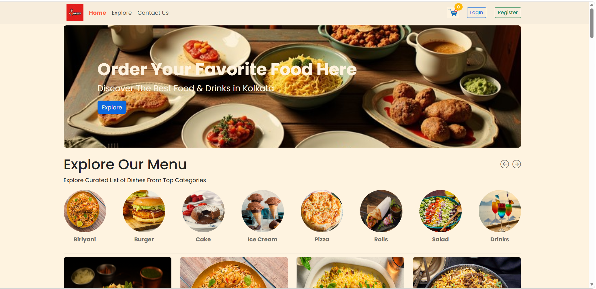
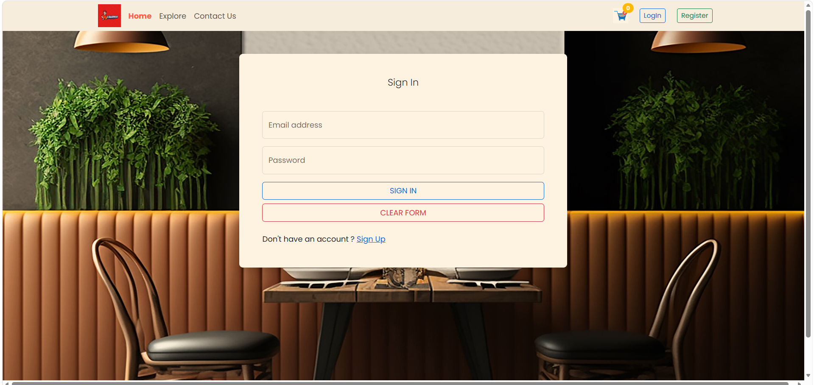
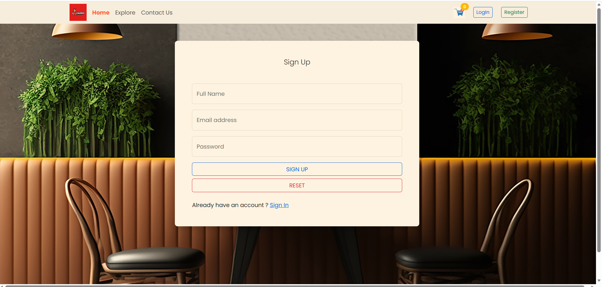
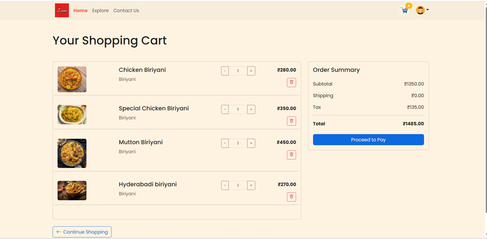
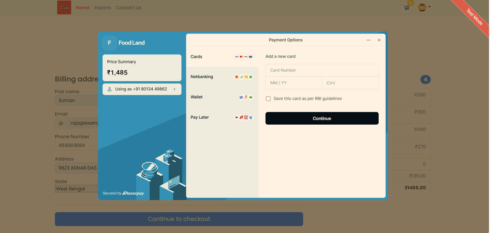
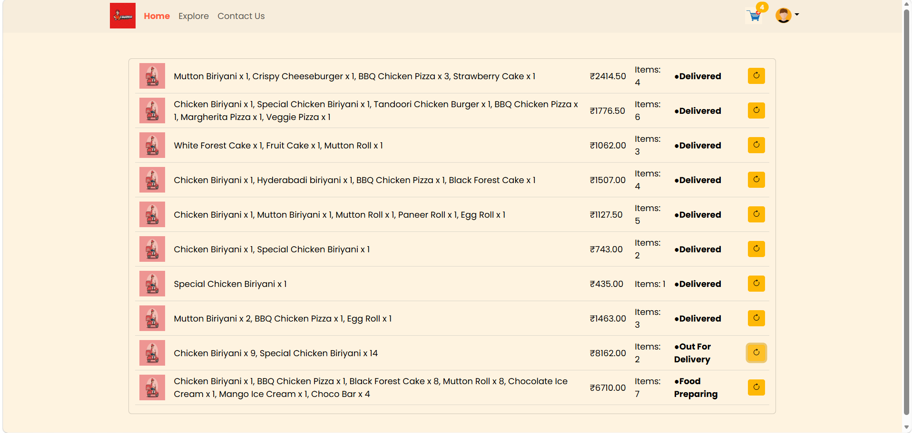
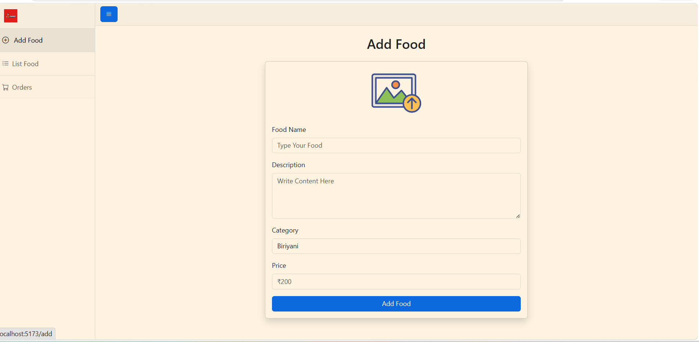
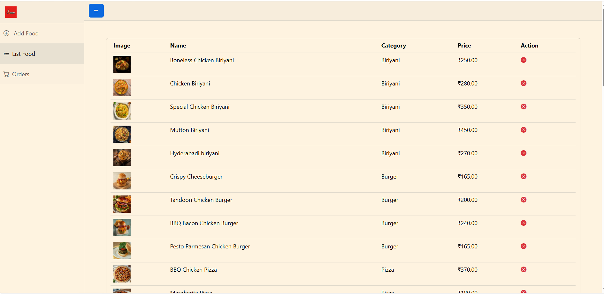
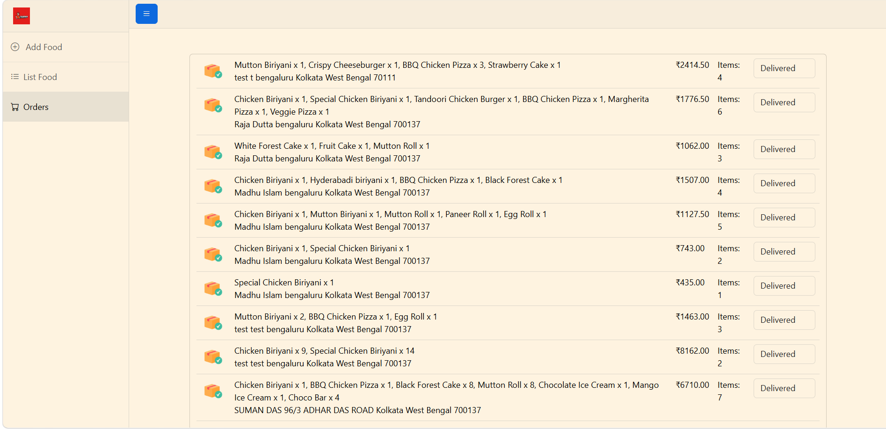

# 🍔 Foodies - Full Stack Food Ordering Application

## 📌 Project Overview

Foodies is a full-stack food ordering web application where users can browse food items, add them to the cart, place orders, and administrators can manage food items and orders.

---

## 🚀 Features

### 👤 User
- User Registration & Login
- JWT Authentication
- Browse Food Items
- Add to Cart
- Place Orders
- View Order History

### 👨‍💼 Admin
- Add Food Items
- Delete Food Items
- View All Orders
- Manage Food Menu

---

## 🛠️ Tech Stack

### Backend
- Java
- Spring Boot
- Spring Security
- JWT
- MongoDB
- Maven
- AWS S3

### Frontend
- React.js
- Vite
- Axios
- HTML
- CSS
- JavaScript

---

## 📂 Project Structure

```
FoodAppFullStack
│
├── foodiesapi
│
├── foodiesapiFrontend
│ ├── frontend-admin
│ └── frontend-user
│
└── README.md
```
## 📸 Project Screenshots

### 🏠 Home Page


### 🔐 User Sign In


### 📝 User Registration


### 🛒 Shopping Cart


### 💳 Payment Page


### 📦 User Orders


### ➕ Admin - Add Food


### 📋 Admin - Food List


### 🚚 Admin - Order Management


---

## 📧 Author

**Raja Dutta**

Final Year CSE Student

Java Full Stack Developer